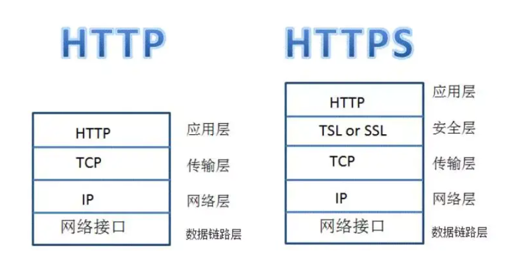

TCP 是端到端的可靠连接，每次链接之前都要进行三次握手，可以保证数据的完整和正确。

UDP 是不可靠的，它只管自己发不管对方接受。

```tip
   所以常用的网页都是基于TCP，而QQ、微信等实时通讯工具和视频等下载都是使用UDP
```

http

什么是 http：它是一种超文本传输协议。http 是基于 TCP 的可靠传输。

1 http1.0

http1.0 在 1996 年就出来了，最初的目的是为了一种发布和接受 html 的方法，从服务器传输超文本到浏览器的传输协议。默认端口 80。

2 http1.1

在 http1.0 出来的半年就出现了，也是现行使用最广泛的协议，http1.1 继承了 1.0 的优点并做了大量改动，主要的一个就是默认 keep-alive 长链接，因为每次握手都带来巨大的开销，长连接（PersistentConnection) 允许用户在一次 TCP 上面发送多个 http,减少大量不必要的开销。

3 http2.0

3.1 多路传输：HTTP/1.X 有个问题叫线端阻塞（head-of-line blocking), 它是指一个链接（connection)一次只提交一个请求的效率比较高，多了就会变慢。HTTP/1.1 试过用流水线(pipelining)来解决这个问题, 但是效果并不理想(数据量较大或者速度较慢的响应, 会阻碍排在他后面的请求). 此外, 由于网络媒介(intermediary )和服务器不能很好的支持流水线, 导致部署起来困难重重。
::: tip
而多路传输(Multiplexing)能很好的解决这些问题, 因为它能同时处理多个消息的请求和响应; 甚至可以在传输过程中将一个消息跟另外一个掺杂在一起。所以客户端只需要一个连接就能加载一个页面。
:::

3.2 spdy 二进制传输

在应用层与传输层之间增加一个二进制分帧层，以此达到“在不改动 HTTP 的语义，HTTP 方法、状态码、URI 及首部字段的情况下，突破 HTTP1.1 的性能限制，改进传输性能，实现低延迟和高吞吐量。”在二进制分帧层上，HTTP2.0 会将所有传输的信息分割为更小的消息和帧,并对它们采用二进制格式的编码，其中 HTTP1.x 的首部信息会被封装到 Headers 帧，而我们的 request body 则封装到 Data 帧里面。

http vs https


