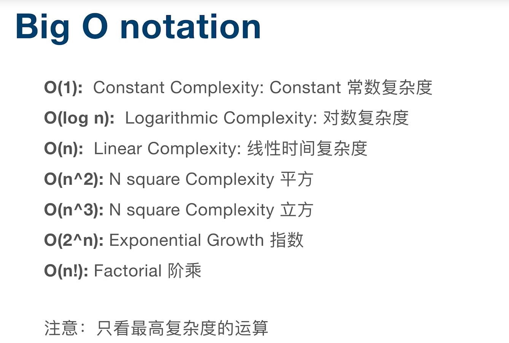
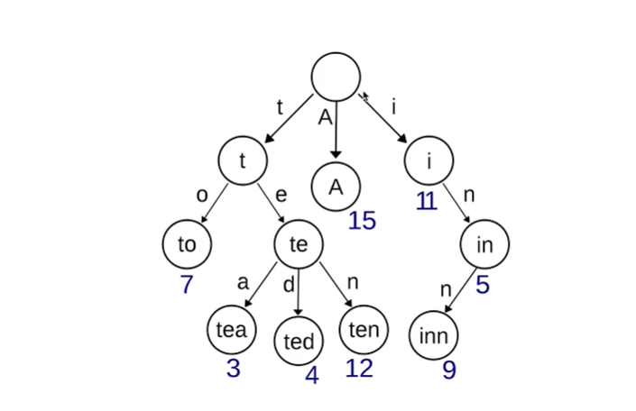

时间复杂度

## 1 链表就是特殊化的树(Tree)
链表查找数据时间复杂度o(n)

## 2 树就是特殊化的图（Graph） 
树有一个根节点 

## 3 二叉搜索树
也称有序二叉树，排序二叉树，是指一颗空树或者具有以下列性质的二叉树
1 左子树上所有结点的值均小于它的根节点的值；
2 右子树上所有结点的值均大于它的根节点的值；
3 递归，左、右子树也分别为二叉树
:::tip

如何判断一颗树是否为二叉搜索树 
用递归判断左子树的最大值是否小于根节点  

用递归判断右子树的最小值是否大于根节点
:::

## 4 Trie树，即字典树，又称单词查找树或键树，是一种树形结构。

### 4.1 基本性质
    1. 根节点不包含字符，除根节点外每一个节点都只包含一个字符。
    2. 从根节点到某一个节点，路径上经过的字符连接起来，为该节点对应的字符串。
    3. 每一个节点的所有子节点包含的字符都不相同。
