### 1. 什么是内存泄漏？
申请的内存没有及时回收掉,被泄漏了。

### 2. 为什么会发生内存泄漏？
虽然前端有垃圾回收机制，但当某块无用的内存，却无法被垃圾回收机制认为是垃圾时,也就发生内存泄漏。

内存发生泄漏的根本原因
::: tip
垃圾回收机制通常是使用标志清除策略,简单说,也就是应用从根节点开始是否可达来判断是否是垃圾
:::

内存发生泄漏的直接原因
::: tip
当不同的生命周期代码有相互通信事，一方生命周期改回收了,却被另一方继续持有时,也就发生了内存泄漏
:::

## <center>那些情况会引起内存泄</center>

### 1. 意外的全局变量
全局变量的生命周期最长,直到页面关闭前,它都存活着,
所以全局变量上的内存一直不会被回收。
当全局变量使用不当时，没有及时回收(手动赋值null),或者拼写错误等将某个变量挂载到全局变量时,也就发生内存泄漏了。
### 2. 遗忘的定时器
setTimeout 和 setIntetval 是由浏览器专门线程来维护它的生命周期,所以当在某个页面使用了定时器,当该页面销毁时，没有手动去释放清理这些定时器的话，那么这些定时器还是存活着的。

如果此时再次打开同一个页面,内存中其实是有双份页面数据的,如果多次关闭、打开,那么内存泄漏会越来越严重

而且这种场景很容易出现,因为使用定时器的人很容易忘记清除

### 3. 使用不当的闭包
函数本身会持有它定义时所在的词法环境的引用,但通常情况下,使用完函数，该函数所申请的内存都会被回收
但是当函数再返回一个函数时，由于返回的函数持有外部函数的词法环境,而返回的函数又被其他生命周期内部所持有时，导致外部函数虽然执行完了，但是内存却无法被回收
所以返回的函数，她的生命周期应该不易过长，方便该闭包能及时被回收

正常情况，闭包并不是内存泄漏，应为这种持有外部函数词法环境本就是闭包的特性，也就是为了让这块内存被回收，因为可能在未来还需要用到，但这无凝会造成内存的消耗，所以不宜滥用

### 4.遗漏的DOM元素
DOM元素的生命周期正常是取决于是否挂载在DOM树上,当从DOM树上移除时,也就可以被销毁回收了
但如果某个DOM元素,在JS中也持有它的引用时，那么它的生命周期就由JS和是否在DOM树上两者决定了,记得移除时，两个地方都需要去清理才能正常回收它
### 5.网络回调
某些场景中，在某个页面发起网络请求，并注册一个回调，且回调函数内持有改页面某些内容，那么当该页面销毁时，应该注销网络的回调，否则网络持有页面部分内容，也会导致页面部分内容无法被回收

## <center>如何检测内存泄漏</center>
内存泄漏可以分为两类：
:::tip
    (1)比较严重的，泄漏的内存一直不能回收。
    (2)没有及时清理导致的内存泄漏, 一段时间后可以被清理掉
:::

针对第一种比较严重的，会发现，内存图里即使不断发生 GC(Grabage collection) 后，所使用的内存总量仍旧在不断增长

另外，内存不足会造成不断 GC，而 GC 时是会阻塞主线程的，所以会影响到页面性能，造成卡顿，所以内存泄漏问题还是需要关注的

我们假设这么一种场景，然后来用开发者工具查看下内存泄漏：

```
    「场景一：在某个函数内申请一块内存，然后该函数在短时间内不断被调用」
    // 点击按钮，就执行一次函数，申请一块内存
    startBtn.addEventListener("click", function() {
        var a = new Array(100000).fill(1);
        var b = new Array(20000).fill(1);
    });
```
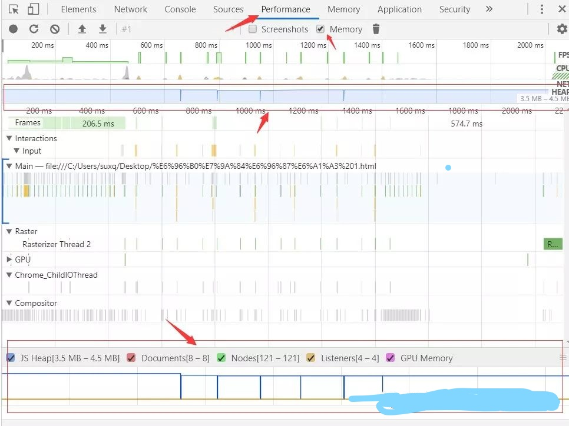


一个页面能够使用的内存是有限的，当内存不足时，就会触发垃圾回收机制去回收没用的内存

而在函数内部使用的变量都是局部变量，函数执行完毕，这块内存就没用可以被回收了

所以当我们短时间内不断调用该函数时，可以发现，函数执行时，发现内存不足，垃圾回收机制工作，回收上一个函数申请的内存，因为上个函数已经执行结束了，内存无用可被回收了

:::tip
所以图中呈现内存使用量的图表就是一条横线过去，中间出现多处竖线，其实就是表示内存清空，再申请，清空再申请，每个竖线的位置就是垃圾回收机制工作以及函数执行又申请的时机
:::

「场景二：在某个函数内申请一块内存，然后该函数在短时间内不断被调用，但每次申请的内存，有一部分被外部持有」
```
    // 点击按钮，就执行一次函数，申请一块内存
    var arr = [];
    startBtn.addEventListener("click", function() {
        var a = new Array(100000).fill(1);
        var b = new Array(20000).fill(1);
        arr.push(b);
    });
```
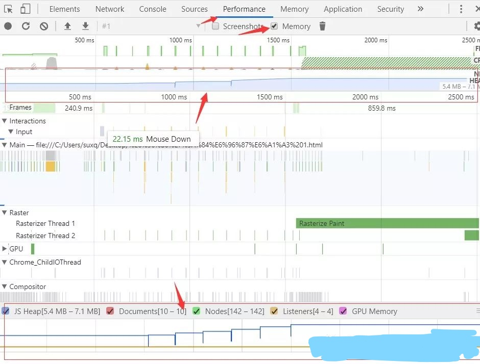

看一下跟第一张图片有什么区别？

    不再是一条横线了吧，而且横线中的每个竖线的底部也不是同一水平了吧

    其实这就是内存泄漏了

我们在函数内申请了两个数组内存，但其中有个数组却被外部持有，那么，即使每次函数执行完，这部分被外部持有的数组内存也依旧回收不了，所以每次只能回收一部分内存

这样一来，当函数调用次数增多时，没法回收的内存就越多，内存泄漏的也就越多，导致内存使用量一直在增长

另外，也可以使用 performance monitor 工具，在开发者工具里找到更多的按钮，在里面打开此功能面板，这是一个可以实时监控 cpu，内存等使用情况的工具，会比上面只能抓取一段时间内工具更直观一点：
    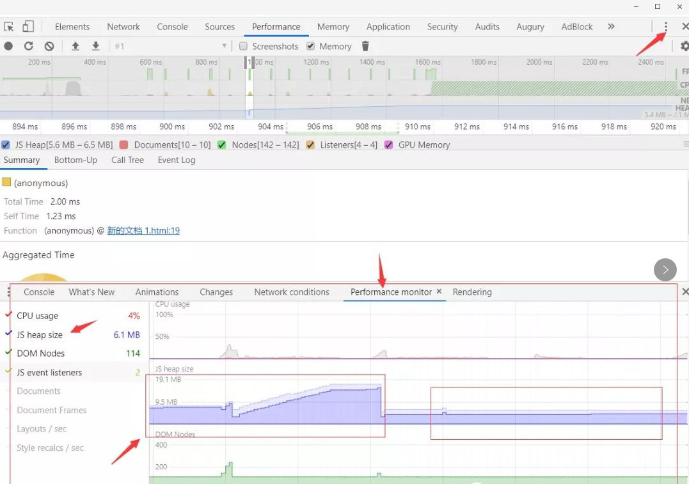
梯状上升的就是发生内存泄漏了，每次函数调用，总有一部分数据被外部持有导致无法回收，而后面平滑状的则是每次使用完都可以正常被回收

这张图需要注意下
:::tip第一个红框末尾有个直线式下滑，这是因为，我修改了代码，把外部持有函数内申请的数组那行代码去掉，然后刷新页面，手动点击 GC 才触发的效果，否则，无论你怎么点 GC，有部分内存一直无法回收，是达不到这样的效果图的
:::

以上，是监控是否发生内存泄漏的一些工具，但下一步才是关键，既然发现内存泄漏，那该如何定位呢？如何知道，是哪部分数据没被回收导致的泄漏呢？
## <center>如何分析内存泄漏，找出有问题的代码</center>
分析内存泄漏的原因，还是需要借助开发者工具的 Memory 功能，这个功能可以抓取内存快照，也可以抓取一段时间内，内存分配的情况，还可以抓取一段时间内触发内存分配的各函数情况

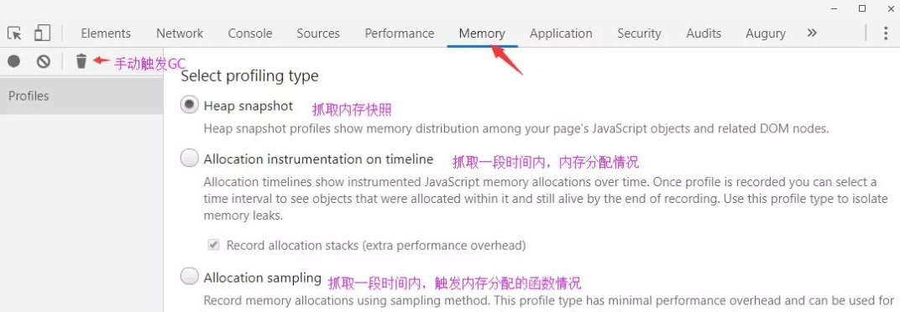

利用这些工具，我们可以分析出，某个时刻是由于哪个函数操作导致了内存分配，分析出大量重复且没有被回收的对象是什么

这样一来，有嫌疑的函数也知道了，有嫌疑的对象也知道了，再去代码中分析下，这个函数里的这个对象到底是不是就是内存泄漏的元凶，搞定

先举个简单例子，再举个实际内存泄漏的例子：
### 「场景一：在某个函数内申请一块内存，然后该函数在短时间内不断被调用，但每次申请的内存，有一部分被外部持有」
:::tip
// 每次点击按钮，就有一部分内存无法回收，因为被外部 arr 持有了
var arr = [];
```
startBtn.addEventListener("click", function() {
    var a = new Array(100000).fill(1);
    var b = new Array(20000).fill(1);
    arr.push(b);
});
```
:::

内存快照


可以抓取两份快照，两份快照中间进行内存泄漏操作，最后再比对两份快照的区别，查看增加的对象是什么，回收的对象又是哪些，如上图。


也可以单独查看某个时刻快照，从内存占用比例来查看占据大量内存的是什么对象，如下图：

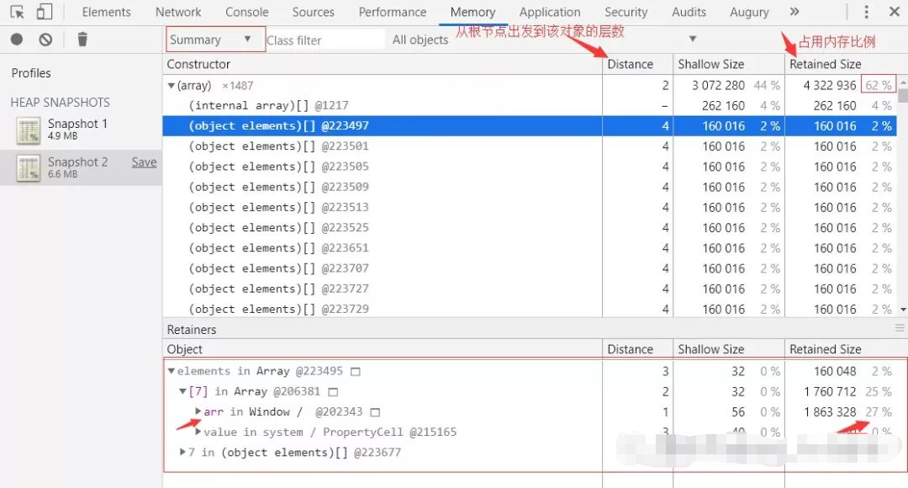

还可以从垃圾回收机制角度出发，查看从 GC root 根节点出发，可达的对象里，哪些对象占用大量内存：

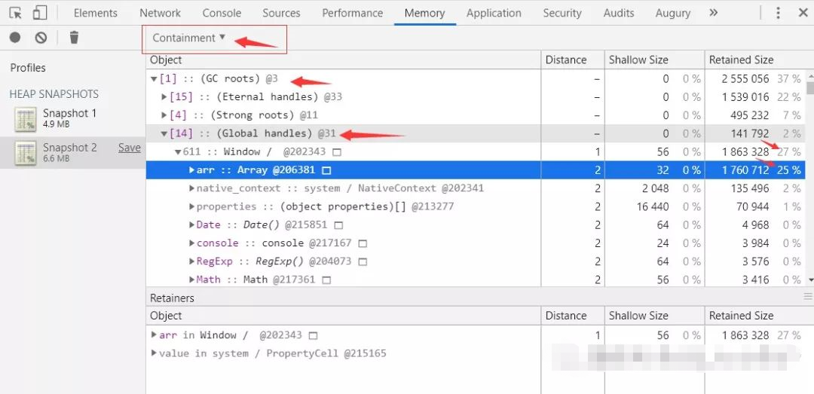


从上面这些方式入手，都可以查看到当前占用大量内存的对象是什么，一般来说，这个就是嫌疑犯了

当然，也并不一定，当有嫌疑对象时，可以利用多次内存快照间比对，中间手动强制 GC 下，看下该回收的对象有没有被回收，这是一种思路

抓取一段时间内，内存分配情况


这个方式，可以有选择性的查看各个内存分配时刻是由哪个函数发起，且内存存储的是什么对象

当然，内存分配是正常行为，这里查看到的还需要借助其他数据来判断某个对象是否是嫌疑对象，比如内存占用比例，或结合内存快照等等

抓取一段时间内函数的内存使用情况

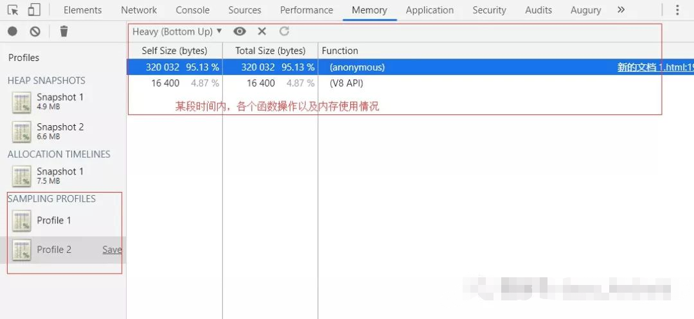

这个能看到的内容很少，比较简单，目的也很明确，就是一段时间内，都有哪些操作在申请内存，且用了多少

总之，这些工具并没有办法直接给你答复，告诉你 xxx 就是内存泄漏的元凶，如果浏览器层面就能确定了，那它干嘛不回收它，干嘛还会造成内存泄漏

:::
所以，这些工具，只能给你各种内存使用信息，你需要自己借助这些信息，根据自己代码的逻辑，去分析，哪些嫌疑对象才是内存泄漏的元凶
:::

## <center>实例分析</center>

来个网上很多文章都出现过的内存泄漏例子：

    var t = null;
    var replaceThing = function() {
        var o = t
        var unused = function() {
            if (o) {
                console.log("hi")
            }
        }

        t = {
            longStr: new Array(100000).fill('*'),
            someMethod: function() {
                console.log(1)
            }
        }
    }
    setInterval(replaceThing, 1000)

也许你还没看出这段代码是不是会发生内存泄漏，原因在哪，不急

先说说这代码用途，声明了一个全局变量 t 和 replaceThing 函数，函数目的在于会为全局变量赋值一个新对象，然后内部有个变量存储全局变量 t 被替换前的值，最后定时器周期性执行 replaceThing 函数

我们先利用工具看看，是不是会发生内存泄漏：

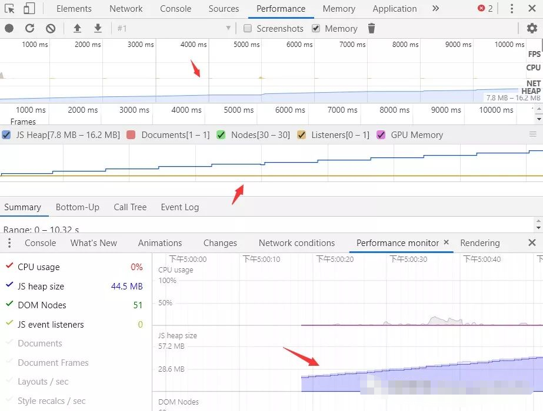

三种内存监控图表都显示，这发生内存泄漏了：反复执行同个函数，内存却梯状式增长，手动点击 GC 内存也没有下降，说明函数每次执行都有部分内存泄漏了

这种手动强制垃圾回收都无法将内存降下去的情况是很严重的，长期执行下去，会耗尽可用内存，导致页面卡顿甚至崩掉

### 分析问题

既然已经确定有内存泄漏了，那么接下去就该找出内存泄漏的原因了


首先通过 sampling profile，我们把嫌疑定位到 replaceThing 这个函数上

接着，我们抓取两份内存快照，比对一下，看看能否得到什么信息：

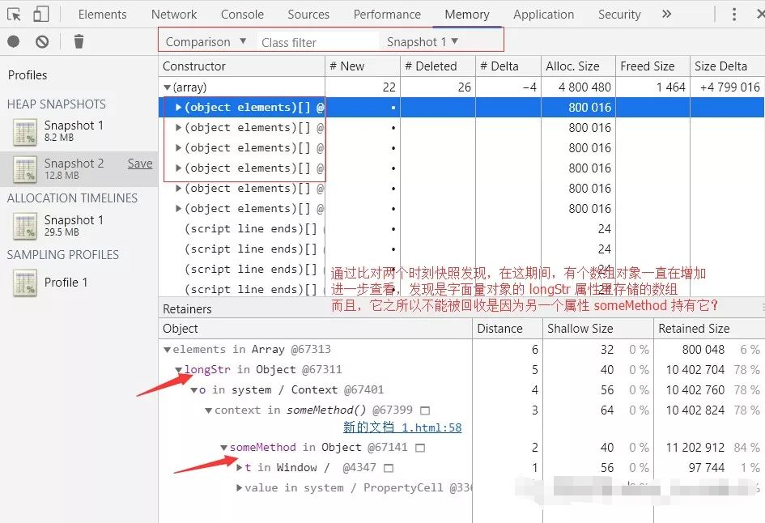

比对两份快照可以发现，这过程中，数组对象一直在增加，而且这个数组对象来自 replaceThing 函数内部创建的对象的 longStr 属性

其实这张图信息很多了，尤其是下方那个嵌套图，嵌套关系是反着来，你倒着看的话，就可以发现，从全局对象 Window 是如何一步步访问到该数组对象的，垃圾回收机制正是因为有这样一条可达的访问路径，才无法回收

其实这里就可以分析了，为了多使用些工具，我们换个图来分析吧

我们直接从第二份内存快照入手，看看：

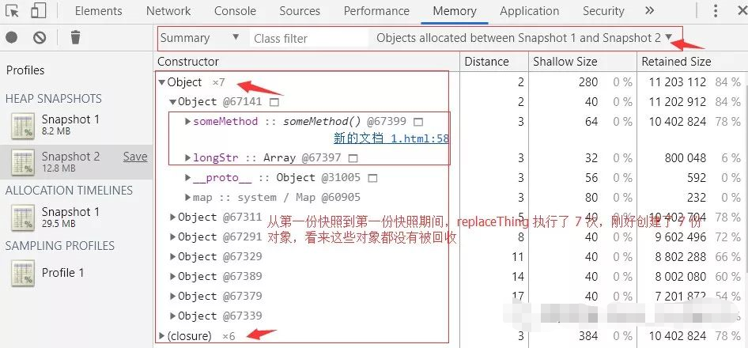

从第一份快照到第二份快照期间，replaceThing 执行了 7 次，刚好创建了 7 份对象，看来这些对象都没有被回收

那么为什么不会被回收呢？

replaceThing 函数只是在内部保存了上份对象，但函数执行结束，局部变量不应该是被回收了么

继续看图，可以看到底下还有个闭包占用很大内存，看看：

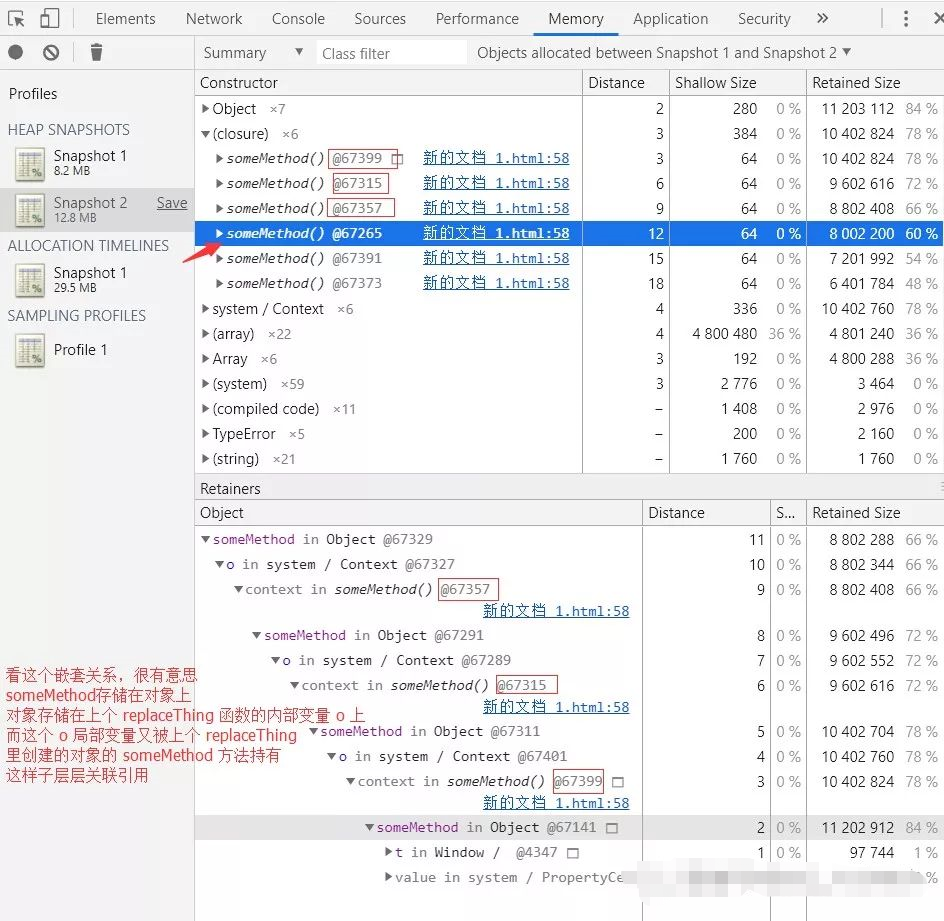

为什么每一次 replaceThing 函数调用后，内部创建的对象都无法被回收呢？

因为 replaceThing 的第一次创建，这个对象被全局变量 t 持有，所以回收不了

后面的每一次调用，这个对象都被上一个 replaceThing 函数内部的 o 局部变量持有而回收不了

而这个函数内的局部变量 o 在 replaceThing 首次调用时被创建的对象的 someMethod 方法持有，该方法挂载的对象被全局变量 t 持有，所以也回收不了

这样层层持有，每一次函数的调用，都会持有函数上次调用时内部创建的局部变量，导致函数即使执行结束，这些局部变量也无法回收

口头说有点懵，盗张图（侵权删），结合垃圾回收机制的标记清除法（俗称可达法）来看，就很明了了：


### 整理结论

根据利用内存分析工具，可以得到如下信息：

:::tip
1. 同一个函数调用，内存占用却呈现梯状式上升，且手动 GC 内存都无法下降，说明内存泄漏了
2. 抓取一段时间的内存申请情况，可以确定嫌疑函数是 replaceThing
3. 比对内存快照发现，没有回收的是 replaceThing 内部创建的对象（包括存储数组的 longStr 属性和方法 someMethod）
4. 进一步分析内存快照发现，之所以不回收，是因为每次函数调用创建的这个对象会被存储在函数上一次调用时内部创建的局部变量 o 上
5. 而局部变量 o 在函数执行结束没被回收，是因为，它被创建的对象的 someMethod 方法所持有
6. 以上，就是结论，但我们还得分析为什么会出现这种情况，是吧
:::

其实，这就涉及到闭包的知识点了：

:::tip
MDN 对闭包的解释是，函数块以及函数定义时所在的词法环境两者的结合就称为闭包
:::

而函数定义时，本身就会有一个作用域的内部属性存储着当前的词法环境，所以，一旦某个函数被比它所在的词法环境还长的生命周期的东西所持有，此时就会造成函数持有的词法环境无法被回收

简单说，外部持有某个函数内定义的函数时，此时，如果内部函数有使用到外部函数的某些变量，那么这些变量即使外部函数执行结束了，也无法被回收，因为转而被存储在内部函数的属性上了

还有一个知识点，外部函数里定义的所有函数共享一个闭包，也就是 b 函数使用外部函数 a 变量，即使 c 函数没使用，但 c 函数仍旧会存储 a 变量，这就叫共享闭包

回到这道题

因为 replaceThing 函数里，手动将内部创建的字面量对象赋值给全局变量，而且这个对象还有个 someMethod 方法，所以 someMethod 方法就因为闭包特性存储着 replaceThing 的变量

虽然 someMethod 内部并没有使用到什么局部变量，但 replaceThing 内部还有一个 unused 函数啊，这个函数就使用了局部变量 o，因为共享闭包，导致 someMethod 也存储着 o

而 o 又存着全局变量 t 替换前的值，所以就导致了，每一次函数调用，内部变量 o 都会有人持有它，所以无法回收

想要解决这个内存泄漏，就是要砍断 o 的持有者，让局部变量 o 能够正常被回收

所以有两个思路：要么让 someMethod 不用存储 o；要么使用完 o 就释放；

如果 unused 函数没有用，那可以直接去掉这个函数，然后看看效果：


这里之所以还会梯状式上升是因为，当前内存还足够，还没有触发垃圾回收机制工作，你可以手动触发 GC，或者运行一段时间等到 GC 工作后查看一下，内存是否下降到初始状态，这表明，这些内存都可以被回收的

或者拉份内存快照看看，拉快照时，会自动先强制进行 GC 再拉取快照：


是吧，即使周期性调用 replaceThing 函数，函数内的局部变量 o 即使存储着上个全局变量 t 的值，但毕竟是局部变量，函数执行完毕，如果没有外部持有它的引用，也就可以被回收掉了，所以最终内存就只剩下全局变量 t 存储的对象了

当然，如果 unused 函数不能去掉，那么就只能是使用完 o 变量后需要记得手动释放掉：

```
var unused = function() {
    if (o) {
      console.log("hi")
      o = null;
    }
}
```
:::tip
但这种做法，不治本，因为在 unused 函数执行前，这堆内存还是一直存在着的，还是一直泄漏无法被回收的，与最开始的区别就在于，至少在 unused 函数执行后，就可以释放掉而已

其实，这里应该考虑的代码有没有问题，为什么需要局部变量存储，为什么需要 unused 函数的存在，这个函数的目的又是什么，如果只是为了在将来某个时刻用来判断上个全局变量 t 是否可用，那么为什么不直接再使用个全局变量来存储，为什么选择了局部变量？

所以，当写代码时，当涉及到闭包的场景时，应该要特别注意，如果使用不当，很可能会造成一些严重的内存泄漏场景

应该铭记，闭包会让函数持有外部的词法环境，导致外部词法环境的某些变量无法被回收，还有共享一个闭包这种特性，只有清楚这两点，才能在涉及到闭包使用场景时，正确考虑该如何实现，避免造成严重的内存泄
:::