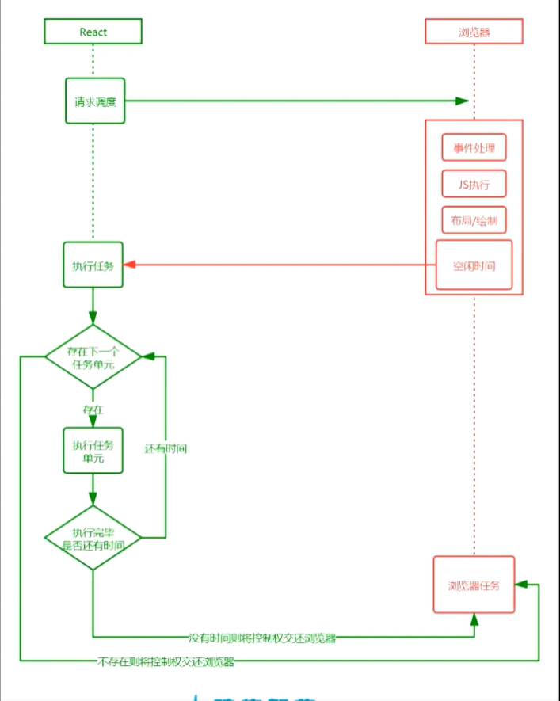
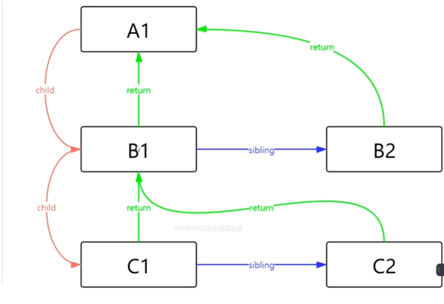

[fiberTree]: ./fiberTree.md

:::tip
    思考：Fiber是怎么实现的？有什么用？怎么使用？
    
:::

## 1.1 Fiber是什么

Fiber 以前的协调

React 会递归比对VirtualDom树, 找出需要变动的节点, 然后同步更新他们。这个过程React称为Reconcilation(协调)

在Reactcilation期间, React会一直占用着浏览器资源, 一则会导致用户出发的事件得不到响应，二则会导致掉帧，用户可能会感觉到卡顿

我们可以通过某些调度策略合理分配CPU资源，从而提高用户的影响速度
通过Fiber架构，让自己的Reconcilation过程变成可被中断。合适地让出CPU执行权，可以让浏览器及时地响应用户的交互


## 1.2 Fiber是一个执行单元

Fiber是一个执行单元，每次执行完一个执行单元，React就会检查现在还剩多少时间，如果没有时间就将控制权让出去



## 1.3 Fiber是一种数据结构
    React目前的做法是使用链表，每个VirtualDOM节点内部表示为一个 Fiber

## 1.4 Fiber数据结构

```js
let VirtualDom = {
    key: 'A1',
    child: [
        {
            key: 'B1',
            child: [
                {
                    key: 'C1',
                    child: []
                },
                {
                    key: 'C2',
                    child: []
                }
            ]
        },
        {
            key: 'B2',
            child: []
        }
    ]
}
```

:::tip
    child指向儿子    sibling指向兄弟 return指向上一级
:::

## 1.5 Fiber执行阶段

每次渲染有两个阶段：Reconciliation(协调render阶段)和commit(提交阶段)
协调阶段：可以认为是Diff阶段，这个阶段可以被中断，这个阶段会找出所有节点变更，例如节点新增、删除、属性变更等等，这些变更React称之为副作用（Effect)

提交阶段：将上一个阶段计算出来的需要处理的副作用（Effect）一次执行了。这个阶段必须同步执行，不能打断

## 2 render阶段
    .render阶段会构建fiber树

[构建fiber树][fiberTree]


<!-- ```js
    class FiberQue {

        consture({playout, next}) {
            this.playout = playout;
            this.next = next;
        }
        questFlash(state, nextState) {
            if(!this.playout) {
                this.playout = this.next = state;
            }else {
                this.playout = state;
                this.next = nextState;
            }
        }
    }

    function changeList(type)  {
        
    }

    let fiber = new FiberQue();

    fiber.questFlash({name: '第一个任务'}, {next: 0});
render()  fiber => c commit 
``` -->
