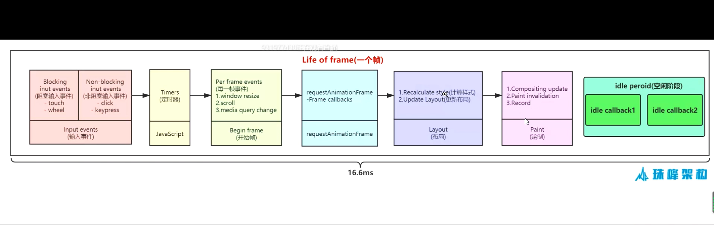

## 1 屏幕刷新率
    
    1s 60帧 写的代码执行时间 在 1000/60 = 16.6ms 最好

## 2一帧执行流程


```js

    // raf的用法

    <div id="progess-bar" style="background: lightblue;width:0;height:20px"></div>
    <button id="btn"></button>

    // 绘制一个进度条

    let btn = document.getElementById("btn");
    let odiv = document.getElementById("progess-bar");

    let start;
    function progress() {
        odiv.style.width = odiv.offsetWidth + 1 + 'px';
        odiv.innerHtml = (odiv.offsetWidth) = '%';
        if(odiv.offsetWidth < 100) {
            let current = Date.now();
            console.log(current - start);
            start = current;
            requestAnimationFrame(progress);

        }
    }
    btn.addEventListener('click', () => {
        odiv.style.width = 0;
        let current = Date.now();

        start = current;

        requestAnimationFrame(progress);
    })
```