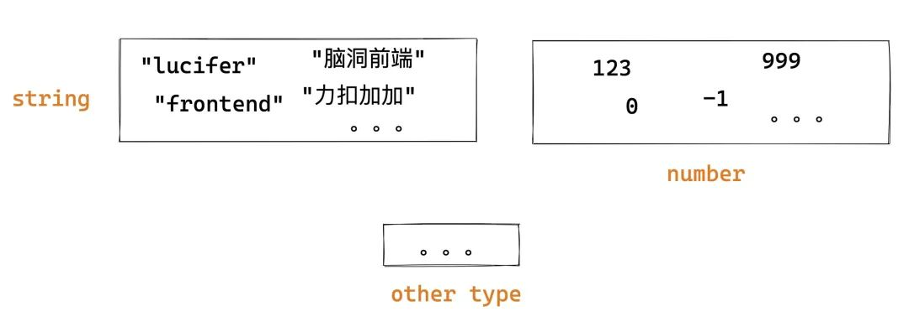
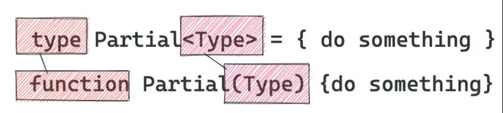
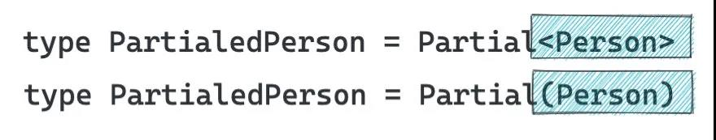
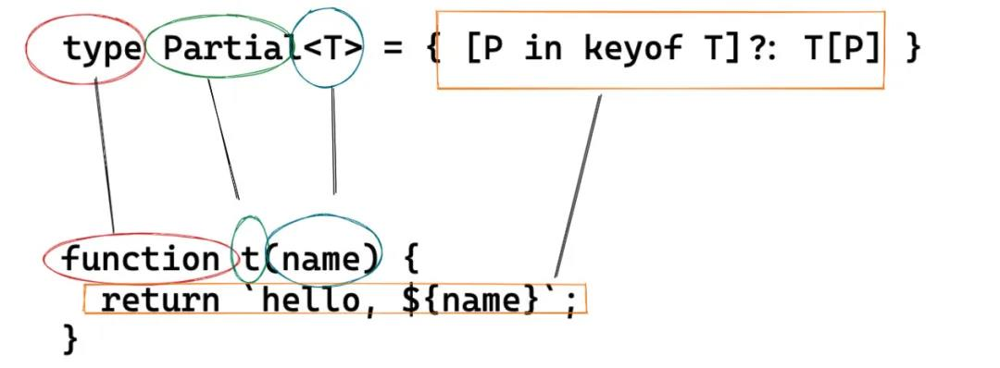
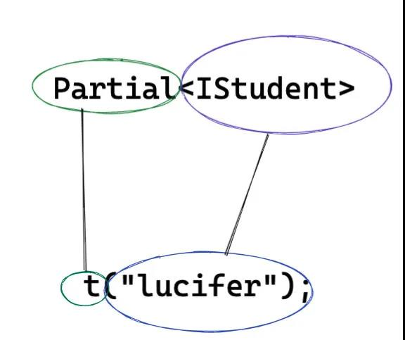
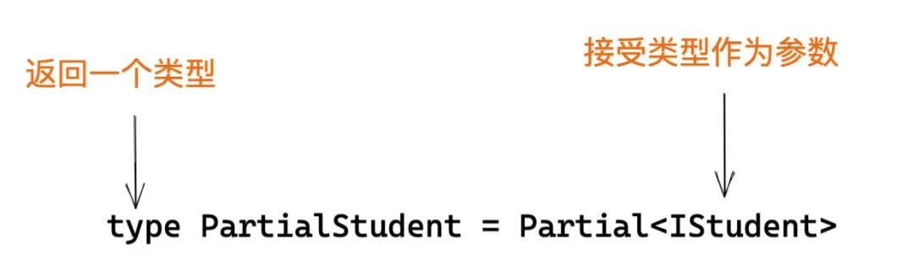
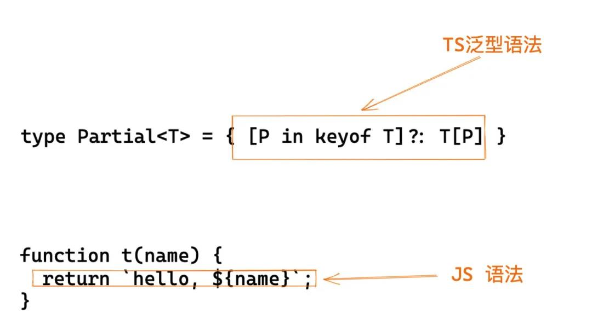
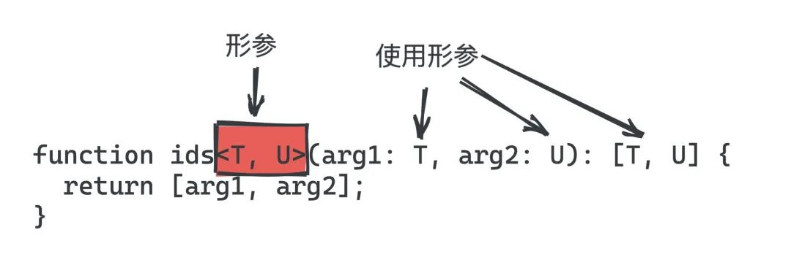
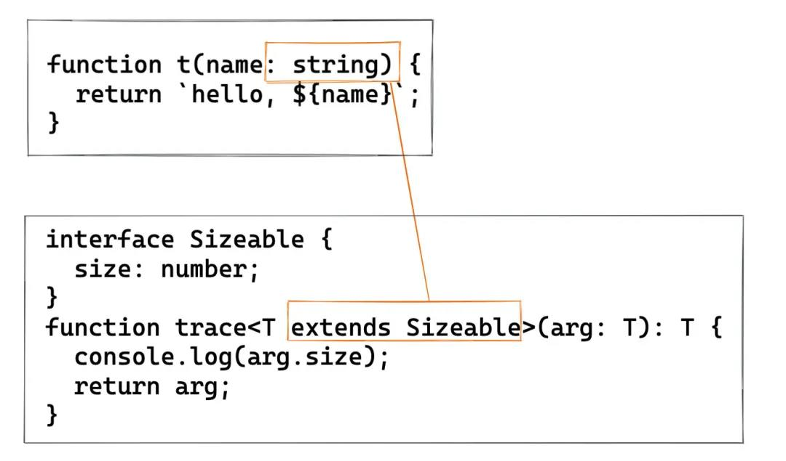
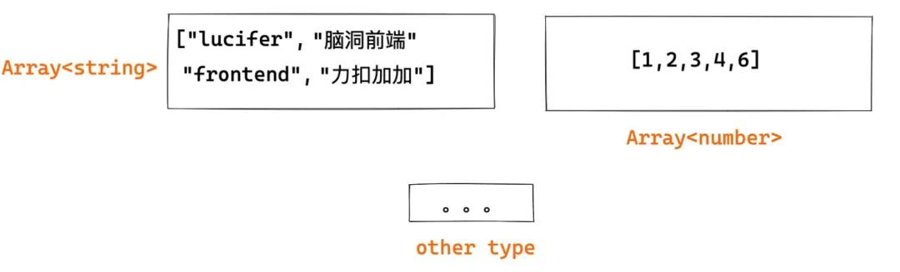

::: tip
   在学习TS过程中很容易和JS语法混淆, 充分理解TS特有的知识，能帮我们快速进步
:::

## 1 什么是泛型
&emsp;&emsp;泛型是允许我们在定义的时候不具体指定类型，而是泛泛地说一种类型，并在函数调用的时候再指定具体的参数类型。
    也就是说泛型也是一种类型，只不过不同于 string, number 等具体的类型，它是一种抽象的类型，我们不能直接定义一个变量类型为泛型。
    简单来说，区别于平时我们对「值」进行编程，泛型是对「类型」进行编程。这个听起来比较抽象。
## 2 区分“值”和“类型”
&emsp;&emsp; (1).平时写JS都是对【值】编程，比如：
```
    if (person.isVIP) {
        console.log('VIP')
    }
    if (cnt > 5) {
        // do something
    }

    const personNames = persons.map(p => p.name)
```
&emsp;&emsp;从集合论的角度上来说， 值的集合就是类型，在 TS 中最简单的用法是对值限定类型，从根本上来说是限定值的集合。这个集合可以是一个具体的集合，也可以是多个集合通过集合运算（交叉并）生成的新集合。


&emsp;&emsp;(2). 类型
&emsp;&emsp;看一个更具体的例子：
```
    function f(name: string) {
        return `hello, ${name}`;
    }
    f("tom");
```
&emsp;&emsp;字符串 "tom" 是 string 「类型」的一个具体「值」。在这里 "tom" 就是值，而 string 就是类型。
TS 明白 "tom" 是 string 集合中的一个元素，因此上面代码不会有问题，但是如果是这样就会报错：
如果是这样就会报错：
```
    f(123);
    f([]);
```
&emsp;&emsp;值的集合就是类型，平时写代码基本都是对值编程，TS 提供了很多「类型」（也可以自定义）以及很多「类型操作」帮助我们「限定值以及对值的操作」。
## 3 为什么要有泛型
&emsp;&emsp;原因实际上有很多，在这里我选择大家普遍认同的一个切入点来解释。如果你明白了这个点，其他点相对而言理解起来会比较轻松。还是通过一个例子来进行说明。

**<center face="黑体" size=40 weight=600><u>不容小觑的 id 函数</u></center>**

&emsp;&emsp;假如让你实现一个函数 id，函数的参数可以是任何值，返回值就是将参数原样返回，并且其只能接受一个参数，你会怎么做？

&emsp;&emsp;你会觉得这很简单，顺手就写出这样的代码：
```
    const id = (arg) => arg;
```
:::tip 
有的人可能觉得 id 函数没有什么实际作用。其实不然， id 函数在函数式编程中应用非常广泛。

:::
&emsp;&emsp;由于其可以接受任意值，也就是说你的函数的入参和返回值都应该可以是任意类型。现在让我们给代码增加类型声明：
```
type idBoolean = (arg: boolean) => boolean;
type idNumber = (arg: number) => number;
type idString = (arg: string) => string;
...
```
&emsp;&emsp;一个笨的方法就像上面那样，也就是说 JS 提供多少种类型，就需要复制多少份代码，然后改下类型签名。这对程序员来说是致命的。<font color="#FA9D30">这种复制粘贴增加了出错的概率，使得代码难以维护，牵一发而动全身。</font>并且将来 JS 新增新的类型，你仍然需要修改代码，也就是说你的代码「对修改开放」，这样不好。还有一种方式是使用 any 这种“万能语法”。缺点是什么呢？我举个例子：
```
id("string").length; // ok
id("string").toFixed(2); // ok
id(null).toString(); // ok
...
```
&emsp;&emsp;如果你使用 any 的话，怎么写都是 ok 的， 这就丧失了类型检查的效果。实际上我知道我传给你的是 string，返回来的也一定是 string，而 string 上没有 toFixed 方法，因此需要报错才是我想要的。也就是说我真正想要的效果是：<font color="#2E6CEA">当我用到id的时候，你根据我传给你的类型进行推导。</font>比如我传入的是 string，但是使用了 number 上的方法，你就应该报错。

&emsp;&emsp;为了解决上面的这些问题，我们「使用泛型对上面的代码进行重构」。和我们的定义不同，<font color="#2E6CEA">这里用了一个 类型 T，这个 「T 是一个抽象类型，只有在调用的时候才确定它的值」</font>，这就不用我们复制粘贴无数份代码了。

&emsp;&emsp;上代码:

```
function id<T>(arg: T): T {
  return arg;
}
```
&emsp;&emsp;为什么这样就可以了？为什么要用这种写法？这个尖括号什么鬼？万物必有因果，之所以这么设计泛型也是有原因的。那么就让我来给大家解释一下，相信很多人都没有从这个角度思考过这个问题。
### <font color="red">小朋友你是不是有很多问号？</font>

**<center face="黑体" size=40 weight=600><u>泛型就是对类型编程</u></center>**

&emsp;&emsp;上面提到了一个重要的点 <font color="#1282EA">平时我们都是对值进行编程，泛型是对类型进行编程。</font>上面我没有给大家解释这句话。现在铺垫足够了，那就让我们开始吧！

&emsp;&emsp;继续举一个例子：假如我们定义了一个 Person 类，这个 Person 类有三个属性，并且都是必填的。这个 Person 类会被用于用户提交表单的时候限定表单数据。
```
enum Sex {
  Man,
  Woman,
  UnKnow,
}
interface Person {
  name: string;
  sex: Sex;
  age: number;
}
```
&emsp;&emsp;突然有一天，公司运营想搞一个促销活动，也需要用到 Person 这个 shape，但是这三个属性都可以选填，同时要求用户必须填写手机号以便标记用户和接受短信。一个很笨的方法是重新写一个新的类：
```
interface MarketPerson {
  phone: string;
  name?: string;
  sex?: Sex;
  age?: number;
}
```
> 还记得我开头讲的重复类型定义么？这就是！

&emsp;&emsp;这明显不够优雅。如果 Person 字段很多呢?这种重复代码会异常多，不利于维护。TS 的设计者当然不允许这么丑陋的设计存在。那么是否可以根据已有类型，生成新的类型呢？当然可以！答案就是前面我提到了两种对类型的操作：<font color="#1282EA">「一种是集合操作，另一种是今天要讲的泛型。」</font>

&emsp;&emsp;先来看下集合操作:

```
type MarketPerson = Person & { phone: string };
```
&emsp;&emsp;这个时候我们虽然添加了一个必填字段 phone，但是没有做到<font color="#1282EA">name, sex, age</font> 选填，似乎集合操作做不到这一点呀。我们脑洞一下，假如我们可以<font color="#1282EA">「像操作函数那样操作类型」，</font>是不是有可能呢？比如我定义了一个函数 <font color="#1282EA">Partial，</font>这个函数的功能入参是一个类型，返回值是新的类型，这个类型里的属性全部变成可选的

&emsp;&emsp;伪代码：
```
function Partial(Type) {
    type ans = 空类型
    for(k in Type) {
        空类型[k]  = makeOptional(Type, k)
    }
    return ans
}

type PartialedPerson = Partial(Person)
```
&emsp;&emsp;可惜的是上面代码不能运行，也不可能运行。不可能运行的原因有：

* &emsp;&emsp;这里使用函数 Partial 操作类型，可以看出上面的函数我是没有添加签名的，我是故意的。如果让你给这个函数添加签名你怎么加？没办法加！

* &emsp;&emsp;这里使用 JS 的语法对类型进行操作，这是不恰当的。首先这种操作依赖了 JS 运行时，而 TS 是静态分析工具，不应该依赖 JS 运行时。其次如果要支持这种操作是否意味者 TS 对 JS 妥协，JS 出了新的语法（比如早几年出的 async await），TS 都要支持其对 TS 进行操作。

&emsp;&emsp;因此迫切需要一种不依赖 JS 行为，特别是运行时行为的方式，并且逻辑其实和上面类似的，且不会和现有语法体系冲突的语法。我们看下 TS 团队是怎么做的：

```
/* 
    可以看成是上面的函数定义，可以接受任意类型。由于是这里的 “Type” 形参，
    因此理论上你叫什么名字都是无所谓的，就好像函数定义的形参一样。
*/ 
type Partial<Type> = { do something }
// 可以看成是上面的函数调用，调用的时候传入了具体的类型 Person
type PartialedPerson = Partial<Person>
```
&emsp;&emsp;先不管功能，我们来看下这两种写法有多像：

&emsp;&emsp; (定义)


&emsp;&emsp; （运行）
&emsp;&emsp;再来看下上面泛型的功能。上面代码的意思是对 T 进行处理，是返回一个 T 的子集，具体来说就是将 T 的所有属性变成可选。这时 <font color="#1282EA">PartialedPerson</font> 就等于 :
```
interface Person {
  name?: string;
  sex?: Sex;
  age?: number;
}
```
> 功能和上面新建一个新的 interface 一样，但是更优雅。

&emsp;&emsp;最后来看下泛型 Partial的具体实现，可以看出其没有直接使用 JS 的语法，而是自己定义了一套语法，比如这里的 keyof，至此完全应证了我上面的观点。
```
type Partial<T> = { [P in keyof T]?: T[P] };
```
> 刚才说了“由于是形参，因此起什么名字无所谓” 。因此这里就起了 T 而不是 Type，更短了。这也算是一种约定俗称的规范，大家一般习惯叫 T， U 等表示泛型的形参。

&emsp;&emsp;我们来看下完整的泛型和函数有多像！


&emsp;&emsp; (定义)

&emsp;&emsp;（使用）

* 从外表看只不过是 function 变成了 type，() 变成了 <>而已。
* 从语法规则上来看， 函数内部对标的是 ES 标准。而泛型对应的是 TS 实现的一套标准。




&emsp;&emsp;简单来说，将类型看成值，然后对类型进行编程，这就是泛型的基本思想。泛型类似我们平时使用的函数，只不过其是作用在类型上，思想上和我们平时使用的函数并没有什么太多不同，泛型产生的具体类型也支持类型的操作。比如：
```
type ComponentType<P = {}> = ComponentClass<P> | FunctionComponent<P>;
```
&emsp;&emsp;有了上面的知识，我们通过几个例子来巩固一下。
```
function id<T, U>(arg1: T, arg2: U): T {
  return arg1;
}
```
&emsp;&emsp;上面定义了泛型 id，其入参分别是 T 和 U，和函数参数一样，使用逗号分隔。定义了形参就可以在函数体内使用形参了。如上我们在函数的参数列表和返回值中使用了形参 T 和 U。

&emsp;&emsp;返回值也可以是复杂类型：
```
function ids<T, U>(arg1: T, arg2: U): [T, U] {
  return [arg1, arg2];
}
```

&emsp;&emsp;（泛型的形参）

> &emsp;&emsp;和上面类似， 只不过返回值变成了数组而已。

> &emsp;&emsp;需要注意的是，思想上我们可以这样去理解。但是具体的实现过程会有一些细微差别，比如：

```
type P = [number, string, boolean];
type Q = Date;

type R = [Q, ...P]; // A rest element type must be an array type.
```
&emsp;&emsp;再比如：
```
type Lucifer = LeetCode;
type LeetCode<T = {}> = {
  name: T;
};

const a: LeetCode<string>; //ok
const a: Lucifer<string>; // Type 'Lucifer' is not generic.
```
&emsp;&emsp;改成这样是 ok 的：
```
type Lucifer<T> = LeetCode<T>;
```
## 4 泛型为什么使用尖括号

&emsp;&emsp;为什么泛型要用尖括号（<>），而不是别的？我猜是因为它和 () 长得最像，且在现在的 JS 中不会有语法歧义。但是，它和 JSX 不兼容！比如：
```
function Form() {
  // ...

  return (
    <Select<string> options={targets} value={target} onChange={setTarget} />
  );
}
```

&emsp;&emsp;这是因为 TS 发明这个语法的时候，还没想过有 JSX 这种东西。后来 TS 团队在 TypeScript 2.9 版本修复了这个问题。也就是说现在你可以直接在 TS 中使用带有泛型参数的 JSX 啦（比如上面的代码）。

## 5泛型的种类

&emsp;&emsp;实际上除了上面讲到的函数泛型，还有接口泛型和类泛型。不过语法和含义基本同函数泛型一样：
（接口泛型）
```
interface id<T, U> {
  id1: T;
  id2: U;
}
```
(类泛型)
```
class MyComponent extends React.Component<Props, State> {
   ...
}
```
:::tip 
总结下就是：泛型的写法就是在标志符后面添加尖括号（<>），然后在尖括号里写形参，并在 body（函数体， 接口体或类体） 里用这些形参做一些逻辑处理。
:::

## 6 泛型的参数类型 - “泛型约束”
&emsp;&emsp;正如文章开头那样，我们可以对函数的参数进行限定。
```
function f(name: string) {
  return `hello, ${name}`;
}
f("tom");
```
&emsp;&emsp;如上代码对函数的形参进行了类型限定，使得函数仅可以接受 string 类型的值。那么泛型如何达到类似的效果呢？

```
type MyType = (T: constrain) => { do something };
```
&emsp;&emsp;还是以 id 函数为例，我们给 id 函数增加功能，使其不仅可以返回参数，还会打印出参数。熟悉函数式编程的人可能知道了，这就是 trace 函数，用于调试程序。
```
function trace<T>(arg: T): T {
  console.log(arg);
  return arg;
}
```
&emsp;&emsp;假如我想打印出参数的 size 属性呢？如果完全不进行约束 TS 是会报错的：
> 注意：不同 TS 版本可能提示信息不完全一致，我的版本是 2.9。下文的所有测试结果均是使用该版本，不再赘述。

```
function trace<T>(arg: T): T {
  console.log(arg.size); // Error: Property 'size doesn't exist on type 'T'
  return arg;
}
```

&emsp;&emsp;报错的原因在于 T 理论上是可以是任何类型的，不同于 any，你不管使用它的什么属性或者方法都会报错（除非这个属性和方法是所有集合共有的）。那么直观的想法是限定传给 trace 函数的<font color="#1282EA">「参数类型」</font>应该有 size 类型，这样就不会报错了。如何去表达这个<font color="#1282EA">「类型约束」</font>的点呢？实现这个需求的关键在于使用类型约束。使用 extends 关键字可以做到这一点。简单来说就是你定义一个类型，然后让 T 实现这个接口即可。

```
interface Sizeable {
  size: number;
}
function trace<T extends Sizeable>(arg: T): T {
  console.log(arg.size);
  return arg;
}
```

&emsp;&emsp;这个时候 T 就不再是任意类型，而是被实现接口的 shape，当然你也可以继承多个接口。「类型约束是非常常见的操作，大家一定要掌握。」

> 有的人可能说我直接将 Trace 的参数限定为 Sizeable 类型可以么？如果你这么做，会有类型丢失的风险，详情可以参考这篇文章A use case for TypeScript Generics[1]。

## 7 常见的泛型

&emsp;&emsp;大家平时写 TS 一定见过类似 ```Array<String>```这种写法吧？这其实是集合类，也是一种泛型。

&emsp;&emsp;本质上数组就是一系列值的集合，这些值可以可以是任意类型，数组只是一个容器而已。然而平时开发的时候通常数组的项目类型都是相同的，如果不加约束的话会有很多问题。比如我应该是一个字符串数组，然是却不小心用到了 number 的方法，这个时候类型系统应该帮我识别出这种<font color="#1282EA">「类型问题」</font>。

&emsp;&emsp;由于数组理论可以存放任意类型，因此需要使用者动态决定你想存储的数据类型，并且这些类型只有在被调用的时候才能去确定。```Array<String>```就是调用，经过这个调用会产生一个具体集合，这个集合只能存放 string 类型的值。



&emsp;&emsp;不调用直接把 Array 是不被允许的：

```
const a: Array = ["1"];
```

&emsp;&emsp;如上代码会被错：<font color="#1282EA">```Generic type 'Array<T>' requires 1 type argument(s).ts ```。 </font>有没有觉得和函数调用没传递参数报错很像？像就对了。

&emsp;&emsp;这个时候你再去看 Set， Promise，是不是很快就知道啥意思了？它们本质上都是包装类型，并且支持多种参数类型，因此可以用泛型来约束。

**<center face="黑体" size=40 weight=600><u>React.FC</u></center>**

&emsp;&emsp;大家如果开发过 React 的 TS 应用，一定知道 React.FC 这个类型。我们来看下它是如何定义的：
```
type FC<P = {}> = FunctionComponent<P>;

interface FunctionComponent<P = {}> {
  (props: PropsWithChildren<P>, context?: any): ReactElement<any, any> | null;
  propTypes?: WeakValidationMap<P>;
  contextTypes?: ValidationMap<any>;
  defaultProps?: Partial<P>;
  displayName?: string;
}
```

&emsp;&emsp;可以看出其大量使用了泛型。你如果不懂泛型怎么看得懂呢？不管它多复杂，我们从头一点点分析就行，记住我刚才讲的类比方法，将泛型类比到函数进行理解。

。首先定义了一个泛型类型 FC，这个 FC 就是我们平时用的 React.FC。它是通过另外一个泛型 FunctionComponent 产生的。

::: tip
因此，实际上第一行代码的作用就是起了一个别名
:::

&emsp;&emsp;FunctionComponent 实际上是就是一个接口泛型，它定义了五个属性，其中四个是可选的，并且是静态类属性。
&emsp;&emsp;displayName 比较简单，而 propTypes，contextTypes，defaultProps 又是通过其他泛型生成的类型。我们仍然可以采用我的这个分析方法继续分析。由于篇幅原因，这里就不一一分析，读者可以看完我的分析过程之后，自己尝试分析一波。
&emsp;&emsp;<font color="#1282EA">```(props: PropsWithChildren<P>, context?: any): ReactElement<any, any> | null```</font>; 的含义是 FunctionComponent 是一个函数，接受两个参数（props 和 context ）返回 ReactElement 或者 null。ReactElement 大家应该比较熟悉了。<font color="#1282EA">PropsWithChildren</font> 实际上就是往 props 中插入 children，源码也很简单，代码如下：

```
type PropsWithChildren<P> = P & { children?: ReactNode };
```

&emsp;&emsp;这不就是我们上面讲的<font color="#1282EA">「集合操作」</font>和 <font color="#1282EA">「可选属性」</font>么？至此，React.FC 的全貌我们已经清楚了。读者可以试着分析别的源码检测下自己的学习效果，比如 React.useState 类型的签名。

## 8 类型推导与默认参数
&emsp;&emsp;类型推导和默认参数是 TS 两个重要功能，其依然可以作用到泛型上，我们来看下。

**<center face="黑体" size=40 weight=600><u>类型推导</u></center>**

&emsp;&emsp;我们一般常见的类型推导是这样的：
```
const a = "lucifer"; // 我们没有给 a 声明类型， a 被推导为 string
a.toFixed(); // Property 'toFixed' does not exist on type 'string'.
a.includes("1"); // ok
```
:::tip
需要注意的是，类型推导是仅仅在初始化的时候进行推导，如下是无法正确推导的：
:::
```
let a = "lucifer"; // 我们没有给 a 声明类型， a 被推导为string
a.toFixed(); // Property 'toFixed' does not exist on type 'string'.
a.includes("1"); // ok
a = 1;
a.toFixed(); // 依然报错， a 不会被推导 为 number
```
&emsp;&emsp;而泛型也支持类型推导，以上面的 id 函数为例：

```
function id<T>(arg: T): T {
  return arg;
}
id<string>("lucifer"); // 这是ok的，也是最完整的写法
id("lucifer"); // 基于类型推导，我们可以这样简写
```

:::tip 
这也就是为什么 useState 有如下两种写法的原因。
:::
```
const [name, setName] = useState("lucifer");
const [name, setName] = useState<string>("lucifer");
```
&emsp;&emsp;实际的类型推导要更加复杂和智能。相信随着时间的推进，TS 的类型推导会更加智能。

## 9 默认参数

&emsp;&emsp;和<font color="#1282EA">类型推导</font>相同的点是，默认参数也可以减少代码量，让你少些代码。前提是你要懂，不然伴随你的永远是大大的问号。其实你完全可以将其类比到函数的默认参数来理解。

举个例子：
```
type A<T = string> = Array<T>;
const aa: A = [1]; // type 'number' is not assignable to type 'string'.
const bb: A = ["1"]; // ok
const cc: A<number> = [1]; // ok
```

&emsp;&emsp;上面的 A 类型默认是 string 类型的数组。你可以不指定，等价于 Array，当然你也可以显式指定数组类型。有一点需要注意：在 JS 中，函数也是值的一种，因此:

```
const fn = () => null; // ok
```

&emsp;&emsp;但是泛型这样是不行的，这是和函数不一样的地方（设计缺陷？Maybe）：

```
type A = Array; // error: Generic type 'Array<T>' requires 1 type argument(s).
```

其原因在与 Array 的定义是：

```
interface Array<T = string> {
    ...
}
```
而如果 Array 的类型也支持默认参数的话，比如：

那么 type A = Array; 就是成立的，如果不指定的话，会默认为 string 类型。

## 10 什么时候用泛型

如果你认真看完本文，相信应该知道什么时候使用泛型了，我这里简单总结一下。

:::tip
当你的函数，接口或者类：

需要作用到很多类型的时候，比如我们介绍的 id 函数的泛型声明。
需要被用到很多地方的时候，比如我们介绍的 Partial 泛型。
:::

## 11 进阶

上面说了泛型和普通的函数有着很多相似的地方。普通的函数可以嵌套其他函数，甚至嵌套自己从而形成递归。泛型也是一样！

**<center face="黑体" size=40 weight=600><u>泛型支持函数嵌套</u></center>**

比如：

```
type CutTail<Tuple extends any[]> = Reverse<CutHead<Reverse<Tuple>>>;
```

如上代码中， Reverse 是将参数列表反转，CutHead 是将数组第一项切掉。因此 CutTail 的意思就是将传递进来的参数列表反转，切掉第一个参数，然后反转回来。换句话说就是切掉参数列表的最后一项。比如，一个函数是 function fn (a: string, b: number, c: boolean):boolean {}，那么经过操作```type cutTailFn = CutTail<typeof fn>```，可以返回(a: string, b:number) => boolean。具体实现可以参考Typescript 复杂泛型实践：如何切掉函数参数表的最后一个参数？[3]。在这里，你知道泛型支持嵌套就够了。

**<center face="黑体" size=40 weight=600><u>泛型支持递归</u></center>**

泛型甚至可以嵌套自己从而形成递归，比如我们最熟悉的单链表的定义就是递归的。

```
type ListNode<T> = {
  data: T;
  next: ListNode<T> | null;
};

```

（单链表）

再比如 <font color="#1282EA">「HTMLElement」</font> 的定义。

```
declare var HTMLElement: {
    prototype: HTMLElement;
    new(): HTMLElement;
};
```

上面是「递归声明」，我们再来看一个更复杂一点的递归形式 - 「递归调用」，这个递归调用的功能是：「递归地将类型中所有的属性都变成可选」。类似于深拷贝那样，只不过这不是拷贝操作，而是变成可选，并且是作用在类型，而不是值。

```
type DeepPartial<T> = T extends Function
  ? T
  : T extends object
  ? { [P in keyof T]?: DeepPartial<T[P]> }
  : T;

type PartialedWindow = DeepPartial<Window>; // 现在window 上所有属性都变成了可选啦
```
## 12 总结
学习 Typescript 并不是一件简单的事情，尤其是没有其他语言背景的情况。而 TS 中最为困难的内容之一恐怕就是泛型了。

泛型和我们平时使用的函数是很像的，如果将两者进行横向对比，会很容易理解，很多函数的都关系可以迁移到泛型，比如函数嵌套，递归，默认参数等等。泛型是对类型进行编程，参数是类型，返回值是一个新的类型。我们甚至可以对泛型的参数进行约束，就类似于函数的类型约束。

最后通过几个高级的泛型用法以及若干使用的泛型工具类帮助大家理解和消化上面的知识。要知道真正的 TS 高手都是玩类型的，高手才不会满足于类型的交叉并操作。泛型用的好确实可以极大减少代码量，提高代码维护性。如果用的太深入，也可能会团队成员面面相觑，一脸茫然。因此抽象层次一定要合理，不仅仅是泛型，整个软件工程都是如此。