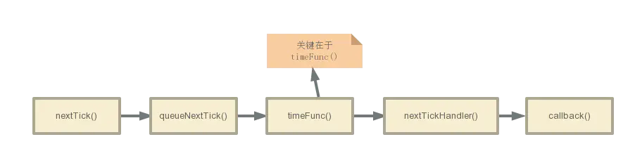
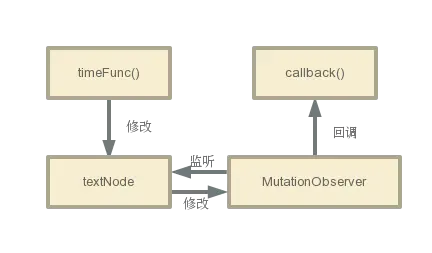

:::tip
看到Vue中的nextTick涉及到Vue中DOM的异步更新，觉得挺有意思，一起来了解一下。
:::

Vue.nextTick的作用
:::tip
Vue.nextTick用于延迟执行一段代码，它接受2个参数（回调函数和执行回调函数的上下文环境），如果没有提供回调函数，那么将返回promise对象。
:::

## 1 nextTick的使用
html
```
<template>
    <div class="app">
    <div ref="contentName">{{name}}</div>
    <div v-if="name1">name got outside $nextTick: {{name1}}</div>
    <div v-if="name2">name got inside $nextTick: {{name2}}</div>
    <div v-if="name3">name got outside $nextTick: {{name3}}</div>
    <button @click="changeName">
        Change the name
    </button>
    </div>
</template>
```
js
```
new Vue({
  el: '.app',
  data: {
    name: '小明',
    name1: '',
    name2: '',
    name3: ''
  },
  methods: {
    changeName() {
      this.name = "小红"
      this.name1 = this.$refs.contentName.innerHTML
      this.$nextTick(() => {
        this.name2 = this.$refs.contentName.innerHTML
      })
      this.name3 = this.$refs.contentName.innerHTML
    }
  }
})
```
:::tip
点击前展示小明， 点击后展示顺序为小明 小红 小明。name2的内容被替换成了小红。因为vue的DOM更新是异步。
:::

## 2 nextTick的应用场景

在Vue生命周期的created()钩子函数进行的DOM操作一定要放在Vue.nextTick()的回调函数中
在created()钩子函数执行的时候DOM 其实并未进行任何渲染，而此时进行DOM操作无异于徒劳，所以此处一定要将DOM操作的js代码放进Vue.nextTick()的回调函数中。与之对应的就是mounted()钩子函数，因为该钩子函数执行时所有的DOM挂载和渲染都已完成，此时在该钩子函数中进行任何DOM操作都不会有问题 。

在数据变化后要执行的某个操作，而这个操作需要使用随数据改变而改变的DOM结构的时候，这个操作都应该放进Vue.nextTick()的回调函数中。
具体原因在Vue的官方文档中详细解释：

:::tip
Vue 异步执行 DOM 更新。只要观察到数据变化，Vue 将开启一个队列，并缓冲在同一事件循环中发生的所有数据改变。如果同一个 watcher 被多次触发，只会被推入到队列中一次。这种在缓冲时去除重复数据对于避免不必要的计算和 DOM 操作上非常重要。然后，在下一个的事件循环“tick”中，Vue 刷新队列并执行实际 (已去重的) 工作。Vue 在内部尝试对异步队列使用原生的 Promise.then 和MessageChannel，如果执行环境不支持，会采用 setTimeout(fn, 0)代替。

:::

:::tip
例如，当你设置vm.setData = 'new data'，该组件不会立即重新渲染。当刷新队列时，组件会在事件循环队列清空时的下一个“tick”更新。多数情况我们不需要关心这个过程，但是如果你想在 DOM 状态更新后做点什么，这就可能会有些棘手。虽然 Vue.js 通常鼓励开发人员沿着“数据驱动”的方式思考，避免直接接触 DOM，但是有时我们确实要这么做。为了在数据变化之后等待 Vue 完成更新 DOM ，可以在数据变化之后立即使用Vue.nextTick(callback) 。这样回调函数在 DOM 更新完成后就会调用。
:::

## 3 nextTick源码解析

官方源码
```
/**
 * Defer a task to execute it asynchronously.
 */
export const nextTick = (function () {
  const callbacks = []
  let pending = false
  let timerFunc

  function nextTickHandler () {
    pending = false
    const copies = callbacks.slice(0)
    callbacks.length = 0
    for (let i = 0; i < copies.length; i++) {
      copies[i]()
    }
  }

  // the nextTick behavior leverages the microtask queue, which can be accessed
  // via either native Promise.then or MutationObserver.
  // MutationObserver has wider support, however it is seriously bugged in
  // UIWebView in iOS >= 9.3.3 when triggered in touch event handlers. It
  // completely stops working after triggering a few times... so, if native
  // Promise is available, we will use it:
  /* istanbul ignore if */
  if (typeof Promise !== 'undefined' && isNative(Promise)) {
    var p = Promise.resolve()
    var logError = err => { console.error(err) }
    timerFunc = () => {
      p.then(nextTickHandler).catch(logError)
      // in problematic UIWebViews, Promise.then doesn't completely break, but
      // it can get stuck in a weird state where callbacks are pushed into the
      // microtask queue but the queue isn't being flushed, until the browser
      // needs to do some other work, e.g. handle a timer. Therefore we can
      // "force" the microtask queue to be flushed by adding an empty timer.
      if (isIOS) setTimeout(noop)
    }
  } else if (!isIE && typeof MutationObserver !== 'undefined' && (
    isNative(MutationObserver) ||
    // PhantomJS and iOS 7.x
    MutationObserver.toString() === '[object MutationObserverConstructor]'
  )) {
    // use MutationObserver where native Promise is not available,
    // e.g. PhantomJS, iOS7, Android 4.4
    var counter = 1
    var observer = new MutationObserver(nextTickHandler)
    var textNode = document.createTextNode(String(counter))
    observer.observe(textNode, {
      characterData: true
    })
    timerFunc = () => {
      counter = (counter + 1) % 2
      textNode.data = String(counter)
    }
  } else {
    // fallback to setTimeout
    /* istanbul ignore next */
    timerFunc = () => {
      setTimeout(nextTickHandler, 0)
    }
  }

  return function queueNextTick (cb?: Function, ctx?: Object) {
    let _resolve
    callbacks.push(() => {
      if (cb) {
        try {
          cb.call(ctx)
        } catch (e) {
          handleError(e, ctx, 'nextTick')
        }
      } else if (_resolve) {
        _resolve(ctx)
      }
    })
    if (!pending) {
      pending = true
      timerFunc()
    }
    if (!cb && typeof Promise !== 'undefined') {
      return new Promise((resolve, reject) => {
        _resolve = resolve
      })
    }
  }
})()
```
首先，先了解nextTick中定义的三个重要变量。

callbacks
用来存储所有需要执行的回调函数

pending
用来标志是否正在执行回调函数

timerFunc
用来触发执行回调函数

接下来，了解nextTickHandler()函数。

```
function nextTickHandler () {
    pending = false
    const copies = callbacks.slice(0)
    callbacks.length = 0
    for (let i = 0; i < copies.length; i++) {
      copies[i]()
    }
  }

```

这个函数用来执行callbacks里存储的所有回调函数。

接下来是将触发方式赋值给timerFunc。

先判断是否原生支持promise，如果支持，则利用promise来触发执行回调函数；
否则，如果支持MutationObserver，则实例化一个观察者对象，观察文本节点发生变化时，触发执行所有回调函数。
如果都不支持，则利用setTimeout设置延时为0。
最后是queueNextTick函数。因为nextTick是一个即时函数，所以queueNextTick函数是返回的函数，接受用户传入的参数，用来往callbacks里存入回调函数。



上图是整个执行流程，关键在于timeFunc()，该函数起到延迟执行的作用。
从上面的介绍，可以得知timeFunc()一共有三种实现方式。

Promise
MutationObserver
setTimeout
其中Promise和setTimeout很好理解，是一个异步任务，会在同步任务以及更新DOM的异步任务之后回调具体函数。

下面着重介绍一下MutationObserver。

MutationObserver是HTML5中的新API，是个用来监视DOM变动的接口。他能监听一个DOM对象上发生的子节点删除、属性修改、文本内容修改等等。
调用过程很简单，但是有点不太寻常：你需要先给他绑回调：

```
var domTarget = 你想要监听的dom节点
mo.observe(domTarget, {
      characterData: true //说明监听文本内容的修改。
})
```



在nextTick中 MutationObserver的作用就如上图所示。在监听到DOM更新后，调用回调函数。
其实使用 MutationObserver的原因就是 nextTick想要一个异步API，用来在当前的同步代码执行完毕后，执行我想执行的异步回调，包括Promise和 setTimeout都是基于这个原因。其中深入还涉及到microtask等内容，暂时不理解，就不深入介绍了。
