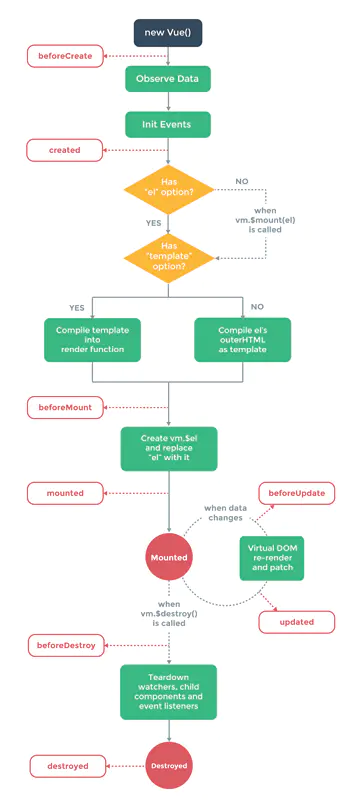

## 1 完整生命周期流程图



## 1.1 beforeCreate执行的操作

```
这时 this.$data为undefi，还不能拿到data中的数据，this.$el也不能访问到
```
:::tip
官方说明：在实例初始化之后，数据观测(data observer) 和 event/watcher 事件配置之前被调用。
:::
翻译过来就是： 注意是 之前，这个时期，this变量还不能使用，在data下的数据，和methods下的方法，watcher中的事件都不能获得到；这个时候的vue实例还什么都没有，但是$route对象是存在的，可以根据路由信息进行重定向之类的操作。

## 1.2 created 功能

```
官方给的说明是：this.$el实例已经创建完成，实例已完成以下配置：数据观测(data observer) ，属性和方法的运算， watch/event 事件回调。然而，挂载阶段还没开始。
data可以访问  watcher events methods可以使用
```

## 1.3 beforeMounte

```
解释说明：但是render正在执行中，此时DOM还是无法操作的。我打印了此时的vue实例对象，相比于created生命周期，此时只是多了一个$el的属性，然而其值为undefined。页面渲染时所需要的数据，应尽量在这之前完成赋值。

```

## 1.4 mounted

```
挂载完毕，这时dom节点被渲染到文档内，一些需要dom的操作在此时才能正常进行。此时元素已经渲染完成了，依赖于DOM的代码就放在这里吧~比如监听DOM事件。
```
## 1.5 beforeUpdate
```
官方说明：$vm.data更新之后，虚拟DOM重新渲染和打补丁之前被调用。
可以对$vm.data进行修改，但是这不会触发附加的重新渲染过程调用。
```

## 1.6 updated
```
当这个钩子被调用时，组件DOM的data已经更新，所以你现在可以执行依赖于DOM的操作。但是不要在此时修改data，否则会继续触发beforeUpdate、updated这两个生命周期，进入死循环！
```
## 1.7 beforeDestroy

```
实例被销毁之前调用。在这一步，实例仍然可用。实例要被销毁了,可以在这一步清除定时器，做一些校验和判断。
```
## 1.8 destroyed

```
此时，Vue实例指示的所有东西已经解绑定，所有的事件监听器都已经被移除，所有的子实例也已经被销毁。这时候能做的事情已经不多了，只能加点儿提示toast之类的东西吧。
```